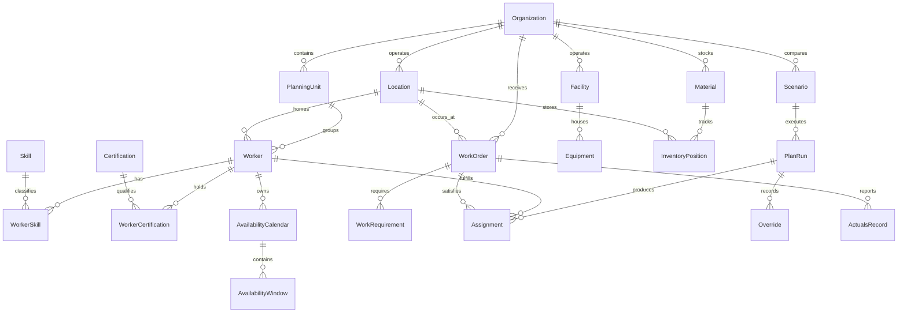

# Initial ERD

This ERD covers the prioritized `v1` entities from the domain model. It is intentionally narrower than the full conceptual model so the first migrations can stay manageable.

## First migration groups

1. `identity` and `org`
2. `workforce`
3. `operations`
4. `planning`
5. `resources`
6. `execution`

That order keeps foreign-key dependencies straightforward and matches the roadmap.

